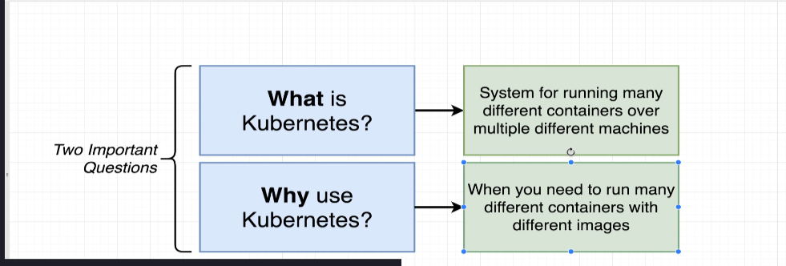
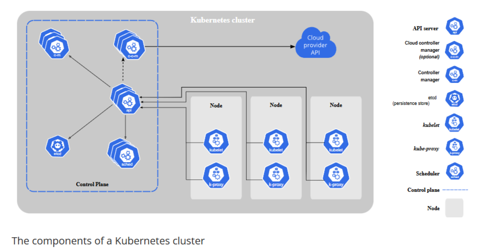
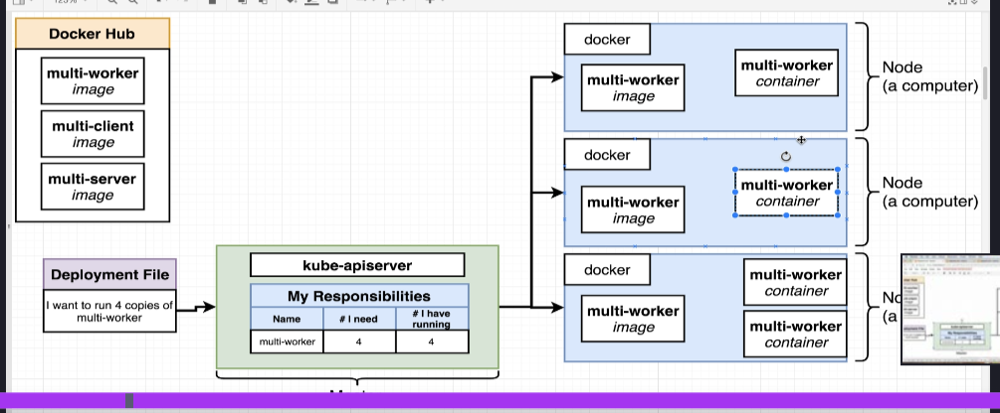
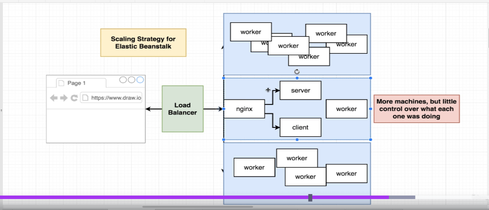
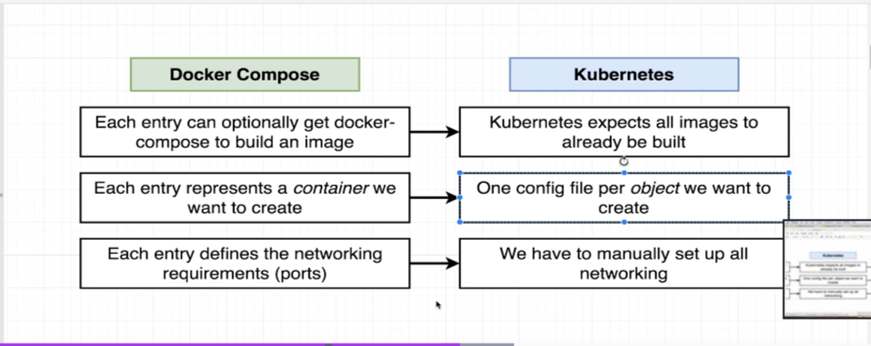

# Kubernetes Overview

Kubernetes is an open-source platform designed to automate deploying, scaling, and operating application containers. It helps manage containerized applications in a clustered environment, ensuring high availability, scalability, and efficient resource utilization.

---

## What and Why Kubernetes?

Kubernetes solves the challenges of managing containerized applications at scale. It provides features like load balancing, service discovery, self-healing, and automated rollouts/rollbacks.



---

## Components of a Kubernetes Cluster

A Kubernetes cluster consists of a **Control Plane** and **Worker Nodes**. The Control Plane manages the cluster, while Worker Nodes run the application workloads.



---

## Kubernetes Command

Kubernetes uses the `kubectl` command-line tool to interact with the cluster. It allows you to deploy applications, inspect resources, and manage the cluster.

### Common `kubectl` Commands
1. **Get Cluster Information**:
   ```bash
   kubectl cluster-info
   ```
   Displays information about the Kubernetes cluster.

2. **List All Nodes**:
   ```bash
   kubectl get nodes
   ```
   Lists all nodes in the cluster.

3. **Deploy an Application**:
   ```bash
   kubectl apply -f <file.yaml>
   ```
   Deploys resources defined in a YAML file.

4. **View Pods**:
   ```bash
   kubectl get pods
   ```
   Lists all pods in the current namespace.

5. **Describe a Pod**:
   ```bash
   kubectl describe pod <pod-name>
   ```
   Displays detailed information about a specific pod.

6. **Delete a Resource**:
   ```bash
   kubectl delete -f <file.yaml>
   ```
   Deletes resources defined in a YAML file.

7. **Scale a Deployment**:
   ```bash
   kubectl scale deployment <deployment-name> --replicas=<number>
   ```
   Scales the specified deployment to the desired number of replicas.

8. **Check Logs**:
   ```bash
   kubectl logs <pod-name>
   ```
   Displays logs from a specific pod.

9. **Execute a Command in a Pod**:
   ```bash
   kubectl exec -it <pod-name> -- <command>
   ```
   Executes a command inside a running pod.

10. **Port Forwarding**:
    ```bash
    kubectl port-forward <pod-name> <local-port>:<pod-port>
    ```
    Forwards a local port to a port on a pod.

---

## Deployment Flow in Kubernetes

The deployment flow in Kubernetes involves several components working together to ensure that your application is deployed and running as expected. Below is an overview of the key components and their roles:

1. **kube-apiserver**:
   - Acts as the central management interface for the Kubernetes cluster.
   - Receives deployment requests (e.g., `kubectl apply -f deployment.yaml`) and validates them.
   - Stores the desired state of the cluster in etcd and communicates with other components to achieve this state.

2. **Nodes**:
   - Nodes are the worker machines (virtual or physical) in the Kubernetes cluster.
   - Each node runs a **kubelet**, which communicates with the `kube-apiserver` to receive instructions and ensure that the desired state is maintained.
   - Nodes also run a **container runtime** (e.g., Docker, containerd) to manage containers.

3. **Docker Containers**:
   - Containers are the smallest deployable units in Kubernetes, encapsulating the application and its dependencies.
   - The container runtime on each node pulls the required container images and runs them as pods.
   - Kubernetes ensures that the containers are running as specified in the deployment configuration.

### Deployment Flow Steps
1. **Submit Deployment**:
   - A user submits a deployment YAML file using `kubectl apply -f deployment.yaml`.
   - The `kubectl` command sends the request to the `kube-apiserver`.

2. **Validate and Store**:
   - The `kube-apiserver` validates the deployment configuration and stores the desired state in etcd.

3. **Schedule Pods**:
   - The Kubernetes scheduler assigns pods to specific nodes based on resource availability and other constraints.

4. **Node Execution**:
   - The `kubelet` on the assigned node pulls the container image using the container runtime (e.g., Docker).
   - The container runtime starts the container and ensures it is running.

5. **Monitor and Maintain**:
   - The `kubelet` continuously monitors the pod's status and reports back to the `kube-apiserver`.
   - If a pod fails, Kubernetes automatically restarts it or reschedules it on another node.



By understanding this flow, you can better grasp how Kubernetes manages the lifecycle of your applications, ensuring high availability and scalability.

---

## Problem Kubernetes is Solving

Kubernetes addresses issues like scaling, fault tolerance, and efficient resource utilization in containerized environments.

For example, consider a project with three containers: `server`, `client`, and `worker`. The `worker` container contains the main logic for processing tasks. If traffic increases, the workload on the `worker` container grows significantly, but the `server` and `client` containers do not require scaling.

### Problem with Docker Compose
Using Docker Compose, scaling only the `worker` container is challenging:
- You would need to manually modify the configuration and restart the setup to scale the `worker` container.
- Traffic distribution and high availability become difficult to manage as the number of containers grows.
- There is no built-in mechanism for automatic scaling based on traffic or resource usage.

### How Kubernetes Solves This Problem
Kubernetes provides features to address these challenges:
1. **Container-Specific Scaling**: Kubernetes allows you to scale individual containers (pods) independently. For example, you can scale only the `worker` pod while keeping the `server` and `client` pods unchanged.
2. **Horizontal Pod Autoscaler (HPA)**: Kubernetes can automatically scale the `worker` pod based on CPU, memory usage, or custom metrics, ensuring efficient resource utilization.
3. **Load Balancing**: Kubernetes provides built-in load balancing to distribute traffic evenly across scaled pods.
4. **Declarative Configuration**: Scaling and other configurations are managed declaratively in YAML files, making it easier to maintain and version control.

By leveraging these features, Kubernetes ensures that the `worker` container can handle increased traffic efficiently without impacting the other containers.



---

## Docker Compose vs Kubernetes

While Docker Compose is suitable for local development, Kubernetes is designed for production-grade orchestration of containers across multiple nodes.



---

Kubernetes is a powerful tool for managing modern cloud-native applications. By understanding its core concepts and components, you can effectively deploy and scale your applications.