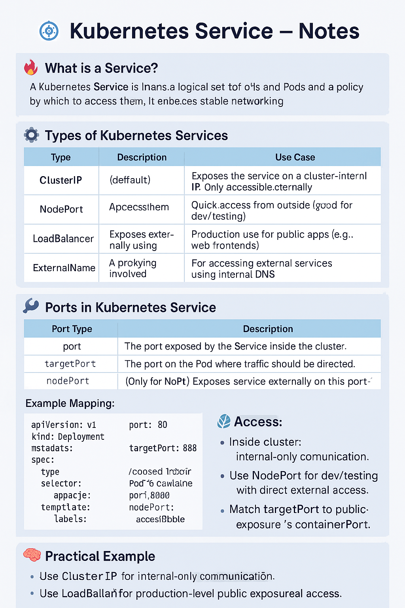

# 📘 Kubernetes Service – Notes

## 🎯 What is a Service?
A **Kubernetes Service** is an abstraction that defines a logical set of Pods and a policy by which to access them.  
It enables stable networking despite dynamic Pod IPs.

---

## 🔥 Types of Kubernetes Services

| Type           | Description                                                                | Use Case                                                   |
|----------------|----------------------------------------------------------------------------|------------------------------------------------------------|
| **ClusterIP**  | Exposes the service on a cluster-internal IP. Only accessible within the cluster. | Internal apps communicating with each other (e.g., backend to DB). |
| **NodePort**   | Exposes the service on each Node’s IP at a static port. Accessible externally. | Quick access from outside (good for dev/testing).          |
| **LoadBalancer** | Exposes the service externally using a cloud provider’s load balancer.      | Production use for public apps (e.g., web frontends).      |
| **ExternalName** | Maps the service to a DNS name. No proxying involved.                   | For accessing external services using internal DNS.        |

---

## ⚙️ Ports in Kubernetes Service

| Port Type     | Description                                                                 |
|---------------|-----------------------------------------------------------------------------|
| `port`        | The port exposed by the Service inside the cluster.                         |
| `targetPort`  | The port on the Pod where traffic should be directed.                      |
| `nodePort`    | (Only for NodePort) A static port on each Node that routes to the Service. |

### Example Mapping:
```yaml
port: 80          # Clients access service via port 80
targetPort: 8080  # Service forwards to Pod’s container port 8080 ( react app running on port 3000)
nodePort: 30080   # (NodePort) Exposes service externally on this port
```

### 🧠 Summary
- Use ClusterIP for internal-only communication.
- Use NodePort for dev/testing with direct external access.
- Use LoadBalancer for production-level public exposure.
- Match targetPort to your container’s containerPort.

### Here is cheatsheet
