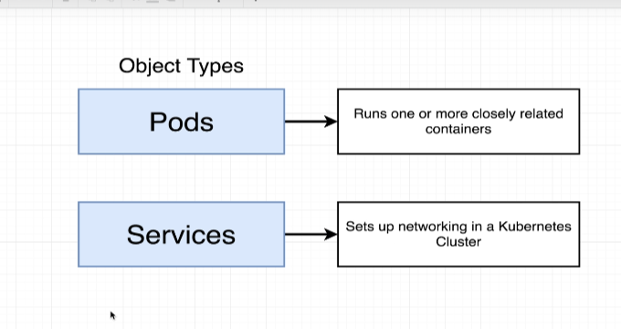
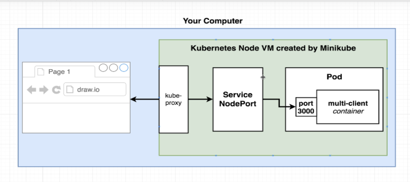
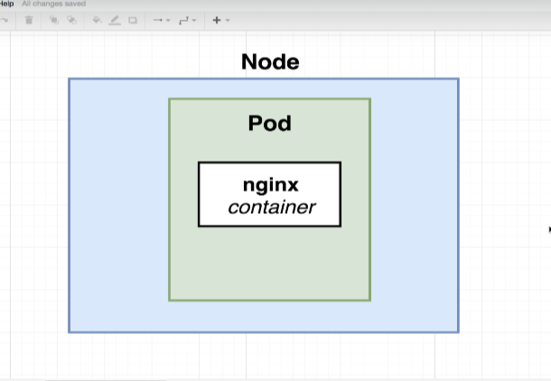
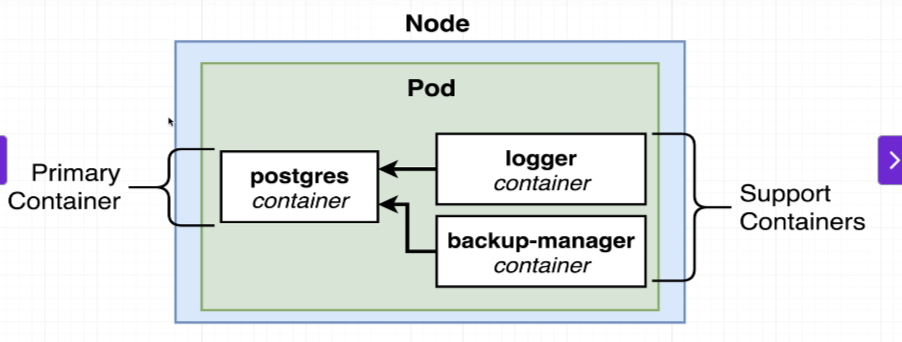
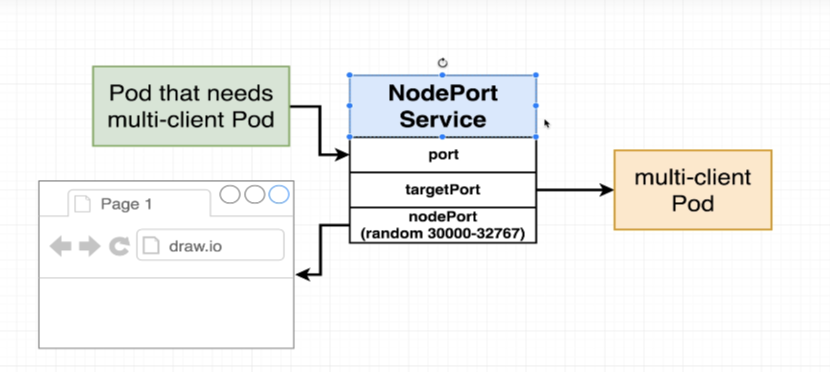
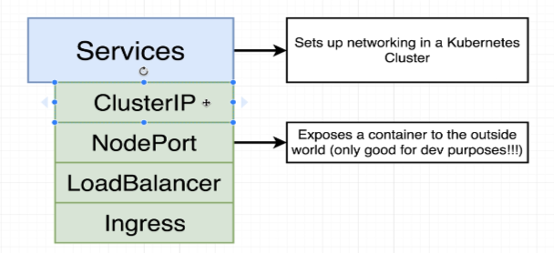

# Simple Kubernetes Configurations

This folder contains simple Kubernetes configurations to help you understand the basics of Kubernetes. Below are some key concepts explained with the help of images and a description of the configuration files.

---

## Difference Between Pod and Services

In Kubernetes, a **Pod** is the smallest deployable unit that can run a single instance of a container, while a **Service** is used to expose Pods to the network and manage communication between them.

---

## How a Service Works

A **Service** in Kubernetes acts as a bridge between external traffic and the Pods. It ensures that traffic is routed to the correct Pod, even if the Pod's IP changes.

---

## Kubernetes Structure of Pod and Node

Kubernetes organizes resources into a hierarchical structure. A **Node** is a worker machine that runs one or more **Pods**. Each Pod contains one or more containers.

---

## Multiple Containers in a Single Pod

Kubernetes allows you to run multiple containers in a single Pod. These containers share the same network namespace and can communicate with each other using `localhost`.

---

## Ports of NodePort Services

A **NodePort** service exposes a specific port on each Node in the cluster, allowing external traffic to access the service.

---

## Subtypes of Services

Kubernetes provides different types of services, such as **ClusterIP**, **NodePort**, and **LoadBalancer**, to handle various networking requirements.

---

## Configuration File Structure

This folder contains two YAML files that define Kubernetes resources. Below is a description of their structure:

### 1. `client-pod.yaml`
This file defines a **Pod** named `client-pod`. It runs a single container using the `learn/multi-client` image. The container listens on port `3000`. 
- **Pod**: The smallest deployable unit in Kubernetes, used to run containerized applications.
- **containerPort**: The port on which the container listens for incoming traffic. This is used internally within the Pod.

### 2. `client-node-port.yaml`
This file defines a **NodePort Service** named `client-node-port`. It exposes the `client-pod` to external traffic on port `31515`.
- **Service**: A Kubernetes object that provides networking capabilities to expose Pods to other Pods or external users.
- **port**: The port on which the Service is exposed internally within the cluster.
- **targetPort**: The port on the container (inside the Pod) that receives the traffic.
- **nodePort**: The port on the Node that allows external access to the Service. This is the port that end users use to access the application.

